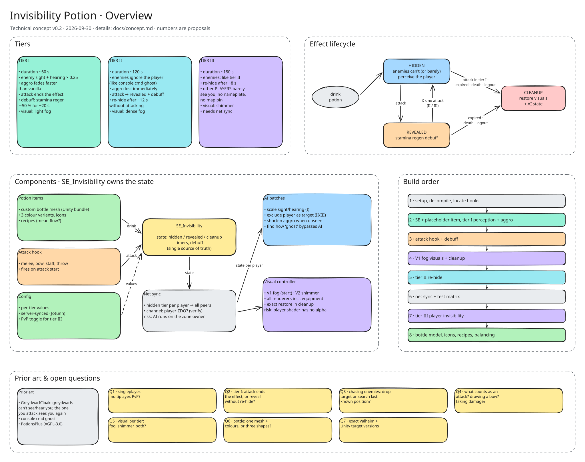

# Invisibility Potion (Valheim mod)

Status: 0.3.0 release candidate (custom models, veil plants, goggles, cultivation); tested in singleplayer, multiplayer pending the dedicated server. Licence: MIT.

Three potions that hide the player from enemies. Attacking reveals the player and slows stamina regeneration. Higher tiers re-hide after a short time and also hide the player from other players.

- [Design spec](docs/superpowers/specs/2026-09-30-invisibility-potion-design.md) – the approved design, start here
- [Technical concept](docs/concept.md) – original draft the spec grew from
- [Overview sketch](docs/overview.excalidraw) – open in Excalidraw (the SVG also contains the scene)
- [Decision records](docs/decisions/)
- [Mod compatibility](docs/compatibility.md) – patches, prefab changes, known interactions
- [Dedicated server](docs/server.md) – BepInEx + Jötunn setup and deploy scripts
- Player-facing description: [Package/README.md](InvisibilityPotion/Package/README.md)

## Targets

Valheim 1.0.16 · Unity 6000.0.75f1 · BepInEx 5.4.23.5 · Jötunn 2.30.2

## Development

Linux, CLI only. Install `dotnet-sdk-8.0`, then `make help`. `make run` starts the game through Steam, which needs a one-time launch option on Valheim: `./start_game_bepinex.sh %command%`. See `CLAUDE.md` for the workflow and `docs/testing.md` for the in-game checklist.
