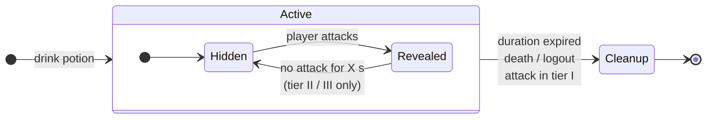
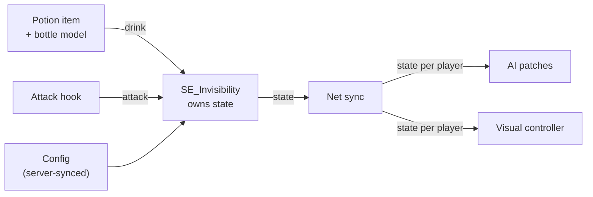

# Invisibility Potion – Technical Concept

Draft v0.2 · 2026-09-30 · Target: Valheim 1.0.x (exact patch to be pinned)
Overview sketch: [`overview.excalidraw`](overview.excalidraw) · Decisions: [`decisions/`](decisions/)

Values marked *(proposal)* are not decided. Game-code method and field names are deliberately left out until verified in the decompiled `assembly_valheim.dll`.

## 1. Features

| ID | Feature |
|---|---|
| F1 | Three potion items with a **custom bottle model** and icons |
| F2 | Drinking applies the invisibility status effect for the tier's duration |
| F3 | Enemies perceive the player less (tier I) or not at all (tier II/III) |
| F4 | Enemies that already chase the player **lose aggro faster**, starting at tier I |
| F5 | Attacking reveals the player and applies a stamina-regen debuff |
| F6 | Tier II/III: re-hidden after X s without attacking |
| F7 | Visual effect: the player looks veiled (fog / shimmer) |
| F8 | Tier III: other players can barely see the player |
| F9 | All values configurable, enforced by the server |

## 2. Tiers *(proposal)*

| | Tier I | Tier II | Tier III |
|---|---|---|---|
| Duration | 60 s | 120 s | 180 s |
| Enemy sight/hearing range | × 0.25 | ignored | ignored |
| Aggro loss when unseen | faster than vanilla | immediate / very fast | immediate / very fast |
| Attack | ends the effect | reveals | reveals |
| Re-hide after | – | 12 s without attack | 8 s without attack |
| Debuff after attack | stamina regen −50 % for 20 s | same | same |
| Visible to players | yes | yes | barely (shimmer), no nameplate |
| Visual | light fog | dense fog | shimmer |

## 3. Effect lifecycle

- Total duration keeps running while `Revealed`.
- Every attack restarts the debuff and the re-hide timer.
- A higher tier replaces an active lower one; a lower tier is refused *(proposal)*.
- `Cleanup` is the only place that restores visuals and AI state. Every exit path goes through it.

### What counts as an attack (to decide)

| Action | Reveals? |
|---|---|
| Melee hit, bow/crossbow shot, staff spell, throw | yes |
| Drawing a bow | ? |
| Taking damage | ? |
| Blocking / parrying | ? |
| Harvesting, doors, chests | no *(proposal)* |

## 4. Architecture

`SE_Invisibility` is the single owner of the state. AI patches and visuals only read it, for every player, through the net-sync layer. Local and remote players therefore behave the same way.

| Component | Responsibility | Technique | To verify in code |
|---|---|---|---|
| Potion item | consumable, applies SE on use | Jötunn `CustomItem`, Unity asset bundle | consume-effect field on the item data |
| `SE_Invisibility` | state, timers, debuff | subclass of `SE_Stats` via Jötunn `CustomStatusEffect` | how `SE_Stats` handles stamina regen modifiers |
| Attack hook | detect attacks → notify SE | Harmony postfix on attack start / projectile spawn | which methods cover melee, bow, staff, throw |
| AI patches | perception + aggro loss | Harmony patches on enemy sight/hearing and target handling | how the `ghost` console command bypasses AI; where "target lost" is decided |
| Net sync | share tier/state with all peers | per-player networked value *(idea: player ZDO)* | whether a ZDO value is the right channel |
| Visual controller | veil / restore renderers | renderer toggling + particle system; optional material swap | full renderer list of the player incl. equipment |
| Config | tier values | BepInEx config, Jötunn server sync | admin-only sync behaviour |

## 5. Systems

### 5.1 Items and bottle model (F1)

- Custom bottle mesh + material built in Unity, shipped as an asset bundle. One mesh, three material/colour variants for the tiers.
- The Unity project must match the game's Unity version; the modding stubs have used different versions over time → pin it in build step 1.
- Valheim loads assets through its own asset-bundle system since 0.217.40 ([FAQ](https://www.valheimgame.com/support/modding-faq-for-the-asset-bundle-update-0-217-40/)); Jötunn's asset tutorial is the reference workflow ([docs](https://valheim-modding.github.io/Jotunn/tutorials/asset-creation.html)).
- Icons rendered from the model (Jötunn `RenderManager`).
- Recipe path *(proposal)*: vanilla mead flow (base in cauldron → fermenter), tier ingredients tied to biomes.

### 5.2 Status effect (F2, F5, F6)

- One class, three configured instances.
- Holds: duration, perception multiplier, aggro-loss time, re-hide delay, debuff reference, visual mode.
- Debuff is a separate `SE_Stats` with reduced stamina regen, applied on attack.
- Lifecycle as in section 3.

### 5.3 Enemy perception and aggro (F3, F4)

Three levers, combined per tier:

| Lever | Tier I | Tier II/III |
|---|---|---|
| Scale sight + hearing range | × 0.25 | – |
| Exclude player as a target | – | yes |
| Shorten time an enemy keeps chasing a player it cannot perceive | faster than vanilla | immediate / very fast |

Open design choice for chasing enemies: drop target instantly, or walk to the last known position and search briefly *(proposal: search briefly)*.

Known risk: enemy AI runs on the **zone owner's** machine, not necessarily the hidden player's. Without net sync (5.6) the effect only works when the hidden player owns the zone. Valheim Legends hit the same class of bug with backstab ([changelog](https://www.nexusmods.com/valheim/mods/796)).

### 5.4 Attack detection (F5)

Hook the start of every attack type from the table in section 3, not the damage event, so the reveal happens before the hit lands.

### 5.5 Visuals (F7, F8)

The player shader `Custom/Player` only exposes `_Cutoff`, no colour alpha, so real translucency via a material parameter is not available ([shader list](https://valheim-modding.github.io/Jotunn/data/prefabs/shader-list.html)).

| Option | How | Cost | Risk |
|---|---|---|---|
| V1 fog *(proposal for start)* | hide renderers partly/fully + particle fog on the player | low | low |
| V2 shimmer | swap materials to `Custom/Distortion` while hidden | medium | unknown look on skinned meshes |
| V3 custom shader | own shader in asset bundle | high | Unity version match; material conflicts with other mods ([example](https://github.com/Vassteel/ValheimHelmsman/issues/1)) |

Requirements for any option:
- Cover all renderers: body, hair, beard, armour, cape, held items.
- Handle equipment changes while hidden.
- The local player still sees a faint version of himself.
- Restore exactly the original state in `Cleanup`.

Tier III additionally: hide nameplate and shared map pin for others.

### 5.6 Network sync (F3, F4, F8)

Valheim is hybrid P2P: the simulation runs on players' machines ([source](https://valhost.net/demo)). Each peer must know every player's hidden state so that AI (zone owner) and visuals (every viewer) react correctly.

Test matrix:

| Setup | I | II | III |
|---|---|---|---|
| Singleplayer | | | |
| Self-hosted, I am host | | | |
| Dedicated, I own the zone | | | |
| Dedicated, another player owns the zone | | | |
| Player joins while I am hidden | | | |

### 5.7 Configuration (F9)

Per tier: duration, perception multiplier, aggro-loss time, re-hide delay, debuff strength/duration, cooldown, recipe. Global: PvP toggle for tier III. Server values override client values.

## 6. Risks

| Risk | Impact | Mitigation |
|---|---|---|
| Patch targets change with game updates | mod half-loads silently ([example](https://github.com/tvongaza/ValheimTesting/issues/30)) | check at startup that every Harmony patch applied, log clearly |
| AI runs on zone owner | effect inconsistent in multiplayer | net sync from the start (5.6) |
| Visual state not restored | player stuck invisible/veiled | single `Cleanup` path, stress test drink/attack/die/logout |
| Unity version mismatch | asset bundle fails to load | pin version in build step 1 |

## 7. Build order

1. Setup, decompile, locate hooks (perception, target loss, `ghost`, attack start).
2. `SE_Invisibility` + placeholder item → tier I perception + aggro loss in singleplayer.
3. Attack hook + debuff.
4. V1 visuals + cleanup.
5. Tier II re-hide.
6. Net sync + test matrix.
7. Tier III player invisibility.
8. Bottle model, icons, recipes, balancing.

## 8. Open questions

| # | Question | Affects |
|---|---|---|
| Q1 | Singleplayer, multiplayer, PvP? | 5.6, tier III |
| Q2 | Tier I: should an attack end the effect, or reveal like tier II without re-hide? | 3, 5.2 |
| Q3 | Chasing enemies: drop target instantly or search last known position? | 5.3 |
| Q4 | Which actions count as an attack? | 3, 5.4 |
| Q5 | Visual per tier: fog, shimmer, or both? | 5.5 |
| Q6 | Bottle look: one mesh with colour variants, or three shapes? | 5.1 |
| Q7 | Exact Valheim and Unity target versions | 5.1, all patches |

## 9. Prior art

- [GreydwarfCloak](https://thunderstore.io/c/valheim/p/sephalon/GreydwarfCloak/) – greydwarfs can neither see nor hear the wearer; an attacked one sees you again. Closest existing mechanic, one enemy family only.
- Console command `ghost` – enemies ignore the player ([source](https://steamcommunity.com/app/892970/discussions/0/3185737486656873051)). Proof that the bypass exists in game code.
- [PotionsPlus](https://github.com/Digitalroot-Valheim/GraveofBears-PotionsPlus) (AGPL-3.0) and [Enhanced Potions](https://valheim.thunderstore.io/package/hbocao/EnhancedPotions/) – potion mods on Jötunn + `SE_Stats`; reference for items, effects, config.

## 10. References

- Jötunn status effects: <https://valheim-modding.github.io/Jotunn/tutorials/status-effects.html>
- Jötunn asset creation: <https://valheim-modding.github.io/Jotunn/tutorials/asset-creation.html>
- Shader list (Valheim 1.0.7): <https://valheim-modding.github.io/Jotunn/data/prefabs/shader-list.html>
